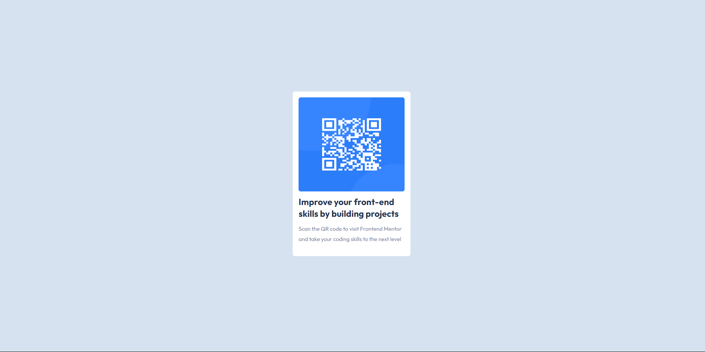

# Frontend Mentor - QR code component solution
This is a solution to the [QR code component challenge on Frontend Mentor](https://www.frontendmentor.io/challenges/qr-code-component-iux_sIO_H). Frontend Mentor challenges help you improve your coding skills by building realistic projects. 

## Table of contents

- [Overview](#overview)
  - [Screenshot](#screenshot)
  - [Links](#links)
- [My process](#my-process)
  - [Built with](#built-with)
 
## Overview

### Screenshot

### Links

- Solution URL: https://github.com/Ismail142/Frotend-Mentor-Challanges/tree/qr-code-component
- Live Site URL: https://vercel.live/link/frotend-mentor-challanges-qxvsrxs73-ismails-projects-cf21dd37.vercel.app?via=deployment-domains-list-commit

## My process

### Built with
- Semantic HTML5 markup
- CSS custom properties
- Flexbox
- Mobile-first workflow
- Tailwind CSS - CSS Framework
